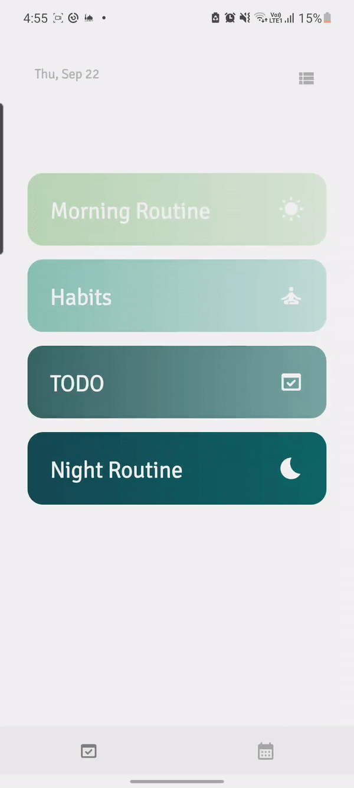
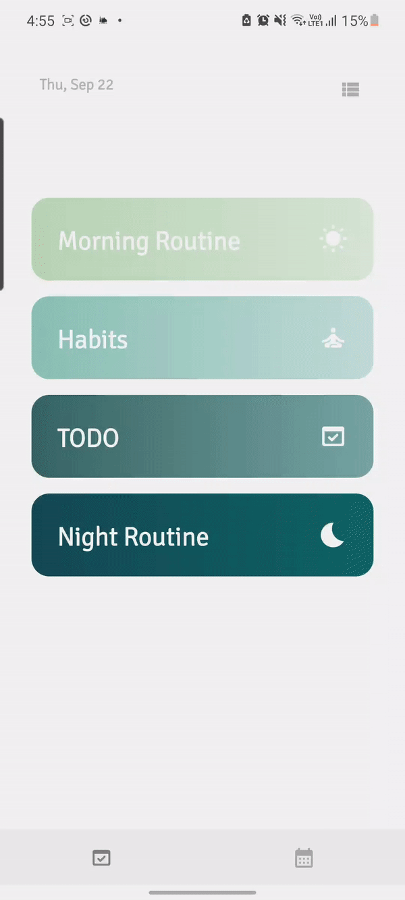

# Android-Productivity-App

This app combines your daily TODO list, habit and routine planner, and monthly planner into one. It was
built in Android Studio using Kotlin, Jetpack Compose, and MVMM Architecture.

It has two main features 

## TODO List

which can be viewed as categorized or non categorized. It utilizes Room to store the items in a local database. A Flow automatically 
renews the items as they are updated, deleted, or added. The non categorized page also contains a toggle so the user can choose whether to
display done items.

The navigation of the app was built using the Jetpack Navigation Component. 

## Monthly planner 

where you can set intentions and goals for your month. Preferences DataStore is used here to store the 
intentions as only 2 strings had to be saved.

